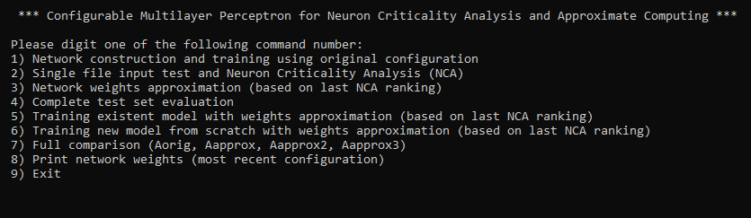

# IOT-Projectwork
Project work of the Internet of Things based Smart Systems course at the University of Catania.

## Topic
** Configurable Multi-layer Perceptron for Neuron Criticality Analysis and Approximate Computing **
- Neuron Criticality Analysis: see [ApproxANN](https://ieeexplore.ieee.org/iel7/7076741/7092347/07092478.pdf).
- Approximate Computing technique: reduction of bits used to store the weights of the neural network neurons.

## References
References available (italian only) at:
- doc/Presentazione.pdf

## Requirements
- [Cmake](https://cmake.org/)

## Build
- Clone this repository:
```bash
git clone https://github.com/marco-prg/IOT-Projectwork
cd IOT-Projectwork
``` 

- After that, run the following commands:
```bash
cd IOT-Projectwork/src
mkdir build 
cd build
cmake ..
make
```
See [TinyDNN](https://github.com/tiny-dnn/tiny-dnn) for details.

- Run the project:
```bash
cd network
./main
```
## Screenshots
###  Main menu:


## External Projects
- TinyDNN: https://github.com/tiny-dnn/tiny-dnn